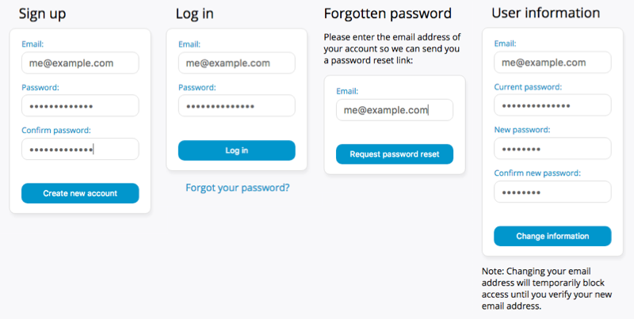

# A Go Package for Common User Workflows

[](https://godoc.org/github.com/rivo/users)
[](https://goreportcard.com/report/github.com/rivo/users)

This Go package provides `net/http` handlers for the following functions:

- Signing up for a new user account
- Logging in and out
- Checking login status
- Resetting forgotten passwords
- Changing email and password



Special emphasis is placed on reducing the risk of someone hijacking user accounts. This is achieved by enforcing a certain user structure and following certain procedures:

- Users are identified by their email address.
- New or changed email addresses must be verified by clicking on a link emailed to that address.
- Users authenticate by entering their email address and a password.
- Password strength checks (based on NIST recommendations).
- Forgotten passwords are reset by clicking on a link emailed to the user.
- It uses [github.com/rivo/sessions](https://github.com/rivo/sessions) (cookie-based web sessions).

## Installation

```
go get github.com/rivo/users
```

## Simple Example

The `users.Main()` function registers all handlers and starts an HTTP server:

```go
if err := users.Main(); err != nil {
  panic(err)
}
```

Alternatively, register the handlers and start the server yourself:

```go
http.HandleFunc(users.Config.RouteSignUp, users.SignUp)
http.HandleFunc(users.Config.RouteVerify, users.Verify)
http.HandleFunc(users.Config.RouteLogIn, users.LogIn)
http.HandleFunc(users.Config.RouteLogOut, users.LogOut)
http.HandleFunc(users.Config.RouteForgottenPassword, users.ForgottenPassword)
http.HandleFunc(users.Config.RouteResetPassword, users.ResetPassword)
http.HandleFunc(users.Config.RouteChange, users.Change)

if err := http.ListenAndServe(users.Config.ServerAddr, nil); err != nil {
  panic(err)
}
```

If you use these handlers as they are, you will need access to an SMTP mail server (for email verification and password reset emails).

For pages behind the login, you can use the `users.IsLoggedIn()` function in your own handler:

```go
user, _, _ := users.IsLoggedIn(response, request)
if user == nil {
  users.RenderProgramError(response, request, "You must be logged in", "", nil)
  return
}
fmt.Fprintf(response, "You are logged in: %s", user.GetEmail())
```

## Configuration

This package uses Golang HTML templates for the various pages and text templates for the various emails sent to the user. Basic templates are provided which can be customized to your needs. Internationalization is supported via the "lang" browser cookie.

The `users.User` type is an interface. Bring your own user model.

The `users.Config` struct provides a number of fields with sensible defaults but which may be customized for your application. Refer to the [Godoc documentation](http://godoc.org/github.com/rivo/users#pkg-variables) for details.

No specific database backend is assumed. The functions to load and save users default to a RAM-based solution but can be customized to access your individual database.

## Documentation

See http://godoc.org/github.com/rivo/users for the documentation.

See also the [https://github.com/rivo/users/wiki](Wiki) for more examples and explanations.

## Your Feedback

Add your issue here on GitHub. Feel free to get in touch if you have any questions.

## Release Notes

- v0.2 (2017-12-04)
  - Changed signature of LoggedIn(), simpler handling
- v0.1 (2017-11-17)
  - First release.
